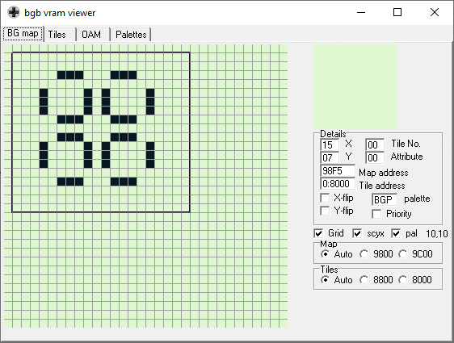
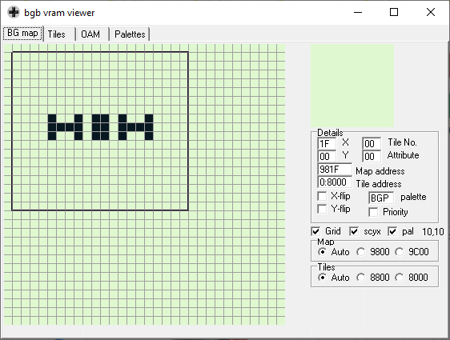
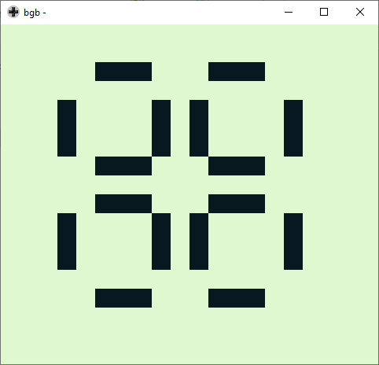

# Conway's Game of Life - Game Boy Version

This is a personal project I made to exercise the basic GB ASM concepts I've been [studying](https://github.com/paulobruno/GbAsmTutorials).  
[Conway's Game of Life](https://en.wikipedia.org/wiki/Conway%27s_Game_of_Life) is a very known cellular automaton and my friend [Arthur Walraven](https://github.com/ArthurWalraven) made me this nice suggestion as a challenge.  
The current result is not ideal and I have several improvements on my TODO list.
However, I'm not sure if I'll keep working on this or just jump directly to another project.

*If you are interested in creating your own Game Boy games/projects, take a look at this really [awesome Game Boy development repo](https://github.com/gbdev/awesome-gbdev).*

*I found an awesome implementation of GB Game of Life from [msklywenn](https://github.com/msklywenn/GB-GameOfLife).*
*If somehow you liked mine, you have to take a look there.*

## Results

```
WARNING: I must warning you that there is a lot of flickering on the last image, sorry about that :(
I don't know if that's the case, but it may cause discomfort or trigger seizures for people with photosensitive epilepsy.
```

I use a double buffer strategy. There are two copies of the state in the Work RAM, one to hold the old state and the other for the current state. After each state update, they are swapped (actually the pointer to each one is swapped) and then the current state is copied to the screen (Video RAM, or VRAM).





```
WARNING: The following image contains flickering animation.
```

Since the current state is moved directly to VRAM as tiles (instead of sprites) and that the Game Boy is not fast enough to copy all tiles into VRAM in a single update, the screen presents a lot of flickering.


